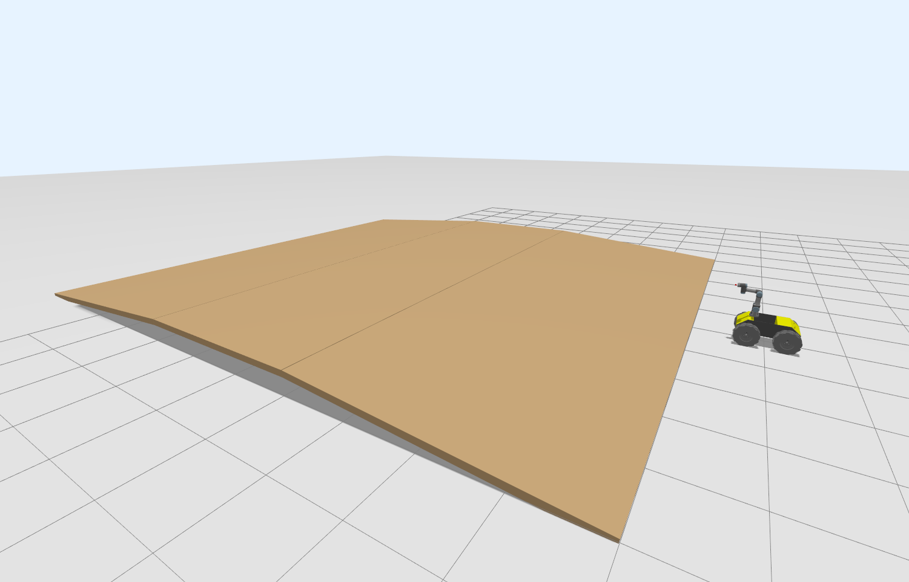
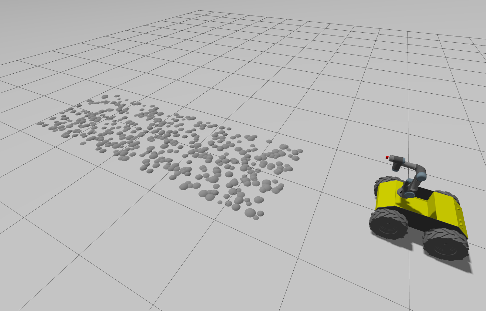
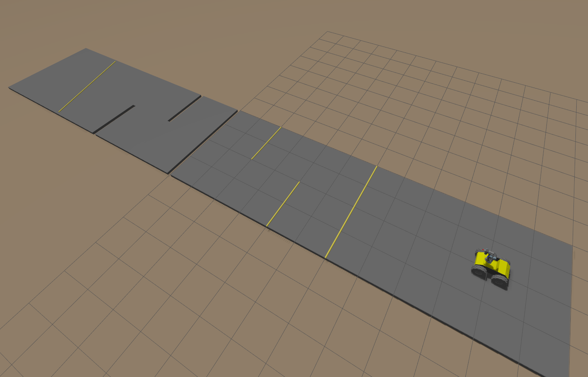

# UR3 End-Effector Stabilization (ROS2: Jazzy)

This package implements a ROS 2 control stack for stabilizing the UR3 arm end-effector mounted on a Clearpath Husky mobile base. It includes multiple controller variants, an inverse kinematics pipeline, simulation launch files, and helper tools for logging and generating test worlds.

## Repository Layout and Detailed Description

- **CMakeLists.txt**: Top-level ROS 2 CMake build file for this package.
- **package.xml**: Package manifest listing dependencies and ROS 2 metadata.
- **README.md**: This documentation file.

- **analysis/**: MATLAB analysis scripts used to validate kinematics and compare logged data.
  - `analysis/matlab_files/compare_rotations.m`: Compare rotation matrices or angles from different sources.
  - `analysis/matlab_files/forward_kinematics.m`: Forward kinematics helper used for end-effector pose validation.
  - `analysis/matlab_files/plot_target_angles.m`: Plot target vs actual joint angles.

- **config/**: YAML configuration for controllers and tuning parameters.
  - `config/husky_ur3_controllers.yaml`: PID/PD gains, computed-torque settings, controller mapping, and other tuning constants.

- **launch/**: ROS 2 Python launch files that set up the simulation and controller nodes.
  - `launch/parkour_pd.launch.py`
  - `launch/parkour_pi_pd.launch.py`
  - `launch/parkour_pid.launch.py`
  - `launch/parkour_ct_pd.launch.py`
  - `launch/parkour_ct_pi_pd.launch.py`
  - `launch/parkour_ct_pid.launch.py`

  Each launch file selects a controller variant and initializes Gazebo, the robot model, the controller manager, and the stabilization nodes.

- **scripts/**: Python helper scripts for logging, reading data, and generating custom worlds.
  - `scripts/matlab_tf_logger.py`: Logs TF and joint-state data for MATLAB analysis.
  - `scripts/read_target_and_actual_angles.py`: Reads recorded target and actual angle CSV logs.
  - `scripts/read_target_angles.py`: Reads a target angle sequence from a file.
  - `scripts/world_generators/`: Generates custom Gazebo world files for testing.

- **src/**: Core C++ nodes and controller implementations.
  - `src/computed_torque_pd.cpp`: Computed-torque controller with PD feedback.
  - `src/computed_torque_pi_pd.cpp`: Computed-torque controller with PI+PD feedback.
  - `src/computed_torque_pid.cpp`: Computed-torque controller with PID feedback.
  - `src/inverse_kinematics.cpp`: Inverse kinematics solver for the UR3 arm.
  - `src/pd_controller.cpp`: PD joint controller node.
  - `src/pi_pd_controller.cpp`: PI+PD controller node.
  - `src/pid_controller.cpp`: PID joint controller node.
  - `src/target_pose_full_rpy.cpp`: Publishes a full target pose with roll, pitch, and yaw.

- **urdf/**: Robot description files for the Husky + UR3 mobile manipulator.
  - `urdf/mobile_manipulator_moveit.urdf`
  - `urdf/mobile_manipulator.urdf.xacro`

- **worlds/**: Simulation world files used to test different terrain and disturbance conditions.
  - `worlds/bumpy_world.sdf`
  - `worlds/extreme_disturbance.world`
  - `worlds/high_freq_bumpy.world`
  - `worlds/hilly_world.sdf`
  - `worlds/street_world.sdf`

## Requirements

- ROS 2 Jazzy or compatible ROS 2 distribution
- `ament_cmake` build system
- C++ toolchain (`gcc` or `clang`)
- `Eigen3`
- ROS 2 packages: `rclcpp`, `std_msgs`, `geometry_msgs`, `sensor_msgs`, `tf2`, `tf2_ros`, `robot_state_publisher`, `xacro`
- Optional: `teleop_twist_keyboard` for keyboard teleoperation

## Installation and Build

Follow these steps to create a workspace from scratch and build the package together with its Clearpath and Universal Robots dependencies.

### 1. Create the workspace root

```bash
mkdir -p ~/ur3_ws/src
cd ~/ur3_ws/src
```

### 2. Create the workspace source layout

Your workspace source tree should contain three main folders:

```text
~/ur3_ws/src/
  ├── clearpath_repositories/
  │   ├── clearpath_common
  │   ├── clearpath_config
  │   ├── clearpath_msgs
  │   └── clearpath_simulator
  ├── universal_robots_repositories/
  │   ├── Universal_Robots_Client_Library
  │   ├── Universal_Robots_ROS2_Description
  │   ├── Universal_Robots_ROS2_Driver
  │   └── Universal_Robots_ROS2_GZ_Simulation
  └── ur3_end_effector_stabilization
```

### 3. Clone Clearpath repositories

```bash
cd ~/ur3_ws/src/clearpath_repositories
git clone https://github.com/clearpathrobotics/clearpath_common.git -b jazzy
git clone https://github.com/clearpathrobotics/clearpath_config.git -b jazzy
git clone https://github.com/clearpathrobotics/clearpath_msgs.git -b jazzy
git clone https://github.com/clearpathrobotics/clearpath_simulator.git -b jazzy
```

### 4. Clone Universal Robots repositories

```bash
cd ~/ur3_ws/src/universal_robots_repositories
git clone https://github.com/UniversalRobots/Universal_Robots_Client_Library.git
git clone https://github.com/UniversalRobots/Universal_Robots_ROS2_Description.git -b jazzy
git clone https://github.com/UniversalRobots/Universal_Robots_ROS2_Driver.git -b jazzy
git clone https://github.com/UniversalRobots/Universal_Robots_ROS2_GZ_Simulation.git
```

### 5. Add this package

Clone or copy this package into `~/ur3_ws/src/ur3_end_effector_stabilization`.

```bash
cd ~/ur3_ws/src
git clone <THIS_PACKAGE_GITHUB_LINK> ur3_end_effector_stabilization
```

### 6. Source ROS 2

Before building, source the ROS 2 environment:

```bash
source /opt/ros/jazzy/setup.bash
```

If you are using another overlay, source that after the base ROS 2 setup.

### 7. Build the workspace

From the workspace root:

```bash
cd ~/ur3_ws
colcon build --symlink-install --cmake-args -DCMAKE_BUILD_TYPE=Release
```

If build failures occur due to missing packages, install the missing dependencies and rerun the build.

### 8. Source the workspace overlay

After a successful build, source the workspace overlay in every new terminal:

```bash
source ~/ur3_ws/install/setup.bash
```

## Quick Start — Launching Simulation

### Basic launch

Run a simulation and controller pipeline using one of the launch files:

```bash
ros2 launch ur3_end_effector_stabilization parkour_pd.launch.py
```

This command loads Gazebo, spawns the mobile manipulator, starts controllers, and begins stabilization with the PD controller.

### Launch with a selected world

Choose a world by passing the `world` argument:

```bash
ros2 launch ur3_end_effector_stabilization parkour_pd.launch.py world:=bumpy_world
```

The launch system will look for the world in `worlds/`.

### Controller launch file choices

- `parkour_pd.launch.py`: PD stabilization controller
- `parkour_pi_pd.launch.py`: PI+PD stabilization controller
- `parkour_pid.launch.py`: PID stabilization controller
- `parkour_ct_pd.launch.py`: Computed torque + PD controller
- `parkour_ct_pi_pd.launch.py`: Computed torque + PI+PD controller
- `parkour_ct_pid.launch.py`: Computed torque + PID controller

### Full launch commands

```bash
ros2 launch ur3_end_effector_stabilization parkour_pd.launch.py
ros2 launch ur3_end_effector_stabilization parkour_pi_pd.launch.py
ros2 launch ur3_end_effector_stabilization parkour_pid.launch.py
ros2 launch ur3_end_effector_stabilization parkour_ct_pd.launch.py
ros2 launch ur3_end_effector_stabilization parkour_ct_pi_pd.launch.py
ros2 launch ur3_end_effector_stabilization parkour_ct_pid.launch.py
```

### How `world:=` works

When you pass `world:=<name>`, the launch file resolves that name to a file in `worlds/`.

For example:

```bash
ros2 launch ur3_end_effector_stabilization parkour_pd.launch.py world:=hilly_world
```

If you need a full path, pass the file path instead of the short name.

## Maps

The package includes four built-in world files for testing different terrain and disturbance scenarios. Use the shown `world:=` names in launch commands.

### Hilly World (`world:=hilly_world`)

A moderately uneven terrain that tests end-effector stability over rolling hills.

World file: `worlds/hilly_world.sdf`



### High Frequency Bumpy World (`world:=high_freq_bumpy`)

A higher-frequency disturbance world that tests controller response to rapid terrain changes.

World file: `worlds/high_freq_bumpy.world`



### Extreme Disturbance (`world:=extreme_disturbance`)

A more aggressive disturbance environment that stresses the stabilizer and evaluates robustness.

World file: `worlds/extreme_disturbance.world`


### Street World (`world:=street_world`)

A structured road test scene for evaluating controller performance on a street-like environment.

World file: `worlds/street_world.sdf`



## Monitoring and Utilities

- Log TF and joint-state data for later analysis:

```bash
ros2 run ur3_end_effector_stabilization matlab_tf_logger.py --ros-args -p use_sim_time:=true
```

- Inspect recorded joint angle logs:

```bash
ros2 run ur3_end_effector_stabilization read_target_and_actual_angles.py
```

## Development Notes

- Computed-torque controllers use the robot dynamics model plus feedback control. The package includes computed torque variants with PD, PI+PD, and PID feedback.
- The inverse kinematics node converts Cartesian end-effector poses into joint-space commands.
- Tuning the gains in `config/husky_ur3_controllers.yaml` is important for different worlds, payloads, and robot motion conditions.

## License

This package is licensed under the Apache-2.0 License.

