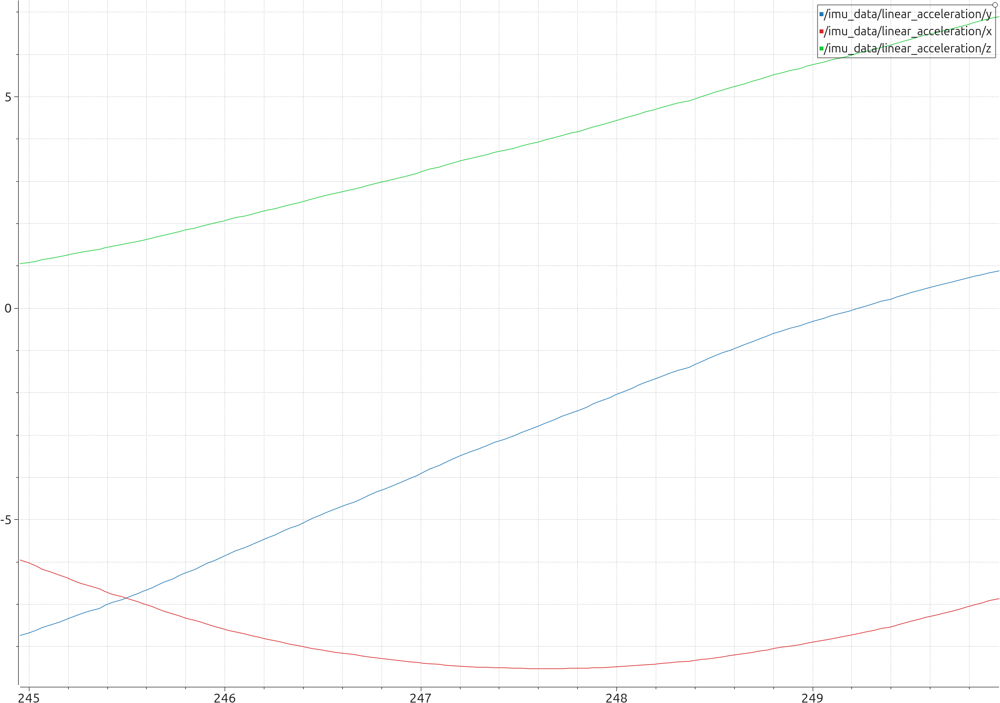

# End Point Stabilization for Mobile Manipulator

Bu proje, UR3 robot kolunu Husky mobil platformu üzerine entegre etmeyi ve uç işleyiciye (end-effector) IMU sensörü ekleyerek kontrol algoritmaları test etmek amacıyla oluşturulmuştur.

## 📅 Proje Durumu
* **Projeye Eklenen Repolar**
  * Universal_Robots_ROS2_Driver [Repo URL](https://github.com/UniversalRobots/Universal_Robots_ROS2_Driver)  
  * Universal_Robots_ROS2_Description Repo URL: [Repo URL](https://github.com/UniversalRobots/Universal_Robots_ROS2_Description)
  * Universal_Robots_ROS2_GZ_Simulation [Repo URL](https://github.com/UniversalRobots/Universal_Robots_ROS2_GZ_Simulation)  
  * Universal_Robots_Client_Library URL: [Repo URL](https://github.com/UniversalRobots/Universal_Robots_Client_Library)


---

## 🏗️ Kurulum ve Derleme (Build)

Bu çalışma alanı ROS 2 Jazzy üzerinde çalışmaktadır. Kaynak kodlar `src` klasörü altındadır.

Derlemek için workspace ana dizininde şu komutlar kullanılır:

```bash
# workspaces'i oluştur
mkdir -p ~/ur3_ws/src

cd ~/ur3_ws

#repo'yu klonla
git clone ["repo url"]

# Bağımlılıkları kontrol et (Opsiyonel)
rosdep install --from-paths src --ignore-src -r -y

# Tüm paketleri derle
colcon build

# Kaynak dosyasını tanıt
source install/setup.bash
```

## 📂 Dosya Mimarisi ve "Wrapper" (Kılıf) Mantığı

Bu projede robotun simülasyon ortamına aktarılması için **katmanlı bir Xacro yapısı** kullanılmıştır. IMU sensörü entegrasyonu, orijinal robot dosyalarını bozmamak adına "Wrapper" seviyesinde yapılmıştır.

Dosya hiyerarşisi ve görevleri şöyledir:

### 1. Wrapper (Kılıf) Dosyası: `ur_gz_imu.urdf.xacro`
* **Konum:** `src/Universal_Robots_ROS2_GZ_Simulation/ur_simulation_gz/urdf/`
* **Görevi:** Bu dosya robotun kendisini değil, simülasyon ortamındaki varlığını ve çevresini tanımlar.
    * **Simülasyon Ortamı:** `world` linki ve robotun üzerinde durduğu `ground_plane` (zemin) burada tanımlıdır.
    * **Gazebo Eklentisi:** Robotun hareket etmesini sağlayan `gz_ros2_control` plugini burada çağrılır.
   
### 2. Core Macro (Çekirdek) Dosyası: `ur_macro.xacro`
* **Konum:** `/opt/ros/jazzy/share/ur_description/urdf`
* **Görevi:** Robotun fiziksel anatomisini (Linkler, Jointler, Boyutlar, Ağırlıklar) tanımlar.
* **İlişki:** Wrapper dosyası, bu dosyayı `<xacro:include>` komutuyla içeri alır.
Universal_Robots_ROS2_Description paketini kullanmıyor ileride bu paketi kaldırabiliriz.

## Simülasyon'u başlat
Terminal 1
```bash
ros2 launch ur_simulation_gz ur_sim_control.launch.py 
```
Terminal 2
```bash
ros2 run plotjuggler plotjuggler
```
Ros topic: /imu_data  imu verileri için
